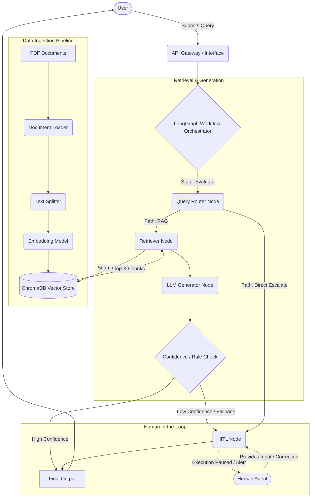

# RAG-Based Customer Support Assistant using LangGraph with Human-in-the-Loop (HITL)

## 1. High-Level Design (HLD)

### 1.1 Problem Definition
Customer support teams often handle repetitive queries that can be resolved by referencing existing documentation (manuals, policies, FAQs). However, relying entirely on fully automated LLM-based systems can lead to hallucinations or incorrect responses, especially for complex, edge-case, or sensitive issues. There is a critical need for a system that can accurately retrieve information from proprietary documents to answer common queries while **seamlessly escalating to a human agent** when the system's confidence is low or the query is explicitly complex.

### 1.2 Scope
**In-Scope:**
*   Ingestion, chunking, and vector indexing of PDF documents (product manuals, FAQs, etc.).
*   Accepting natural language user queries.
*   Retrieving relevant context from the indexed documents using semantic search.
*   Generating accurate answers using an LLM based strictly on the retrieved context (RAG).
*   Evaluating response confidence and identifying escalation triggers.
*   Routing low-confidence or complex queries to a human agent (Human-in-the-Loop).
*   Orchestrating the entire workflow as a stateful graph.

**Out-of-Scope (for this phase):**
*   Integration with live third-party chat platforms (e.g., Zendesk, Slack).
*   Multimodal inputs (images, audio).
*   Real-time voice support.

### 1.3 System Architecture Diagram
The system follows a stateful, graph-based architecture to allow for cyclical workflows and execution pauses required by the HITL module.

### 1.4 System Components
1.  **Document Loader:** Parses PDF files and extracts raw text. Essential for transforming unstructured files into machine-readable strings.
2.  **Chunking Strategy:** Splits long text into smaller, semantically meaningful chunks (e.g., using `RecursiveCharacterTextSplitter`). This ensures chunks fit within LLM context limits and improves retrieval precision.
3.  **Embedding Model:** Converts text chunks into dense vector representations. This allows the system to understand the semantic meaning of the text beyond keyword matching.
4.  **Vector DB (ChromaDB):** Stores the text chunks and their corresponding embeddings, enabling blazing-fast similarity searches when a query is submitted.
5.  **Retriever:** Takes the user query, embeds it using the same embedding model, and performs a similarity search against ChromaDB to fetch the top-K most relevant chunks.
6.  **LLM (Large Language Model):** The core reasoning engine. It synthesizes the retrieved chunks to generate a coherent, context-aware answer.
7.  **LangGraph Workflow Engine:** Manages the state and execution flow of the application. Unlike simple linear chains, it models the process as a state machine, allowing for dynamic routing, loops, and human-in-the-loop pauses.
8.  **Routing Layer:** A conditional edge logic within LangGraph that evaluates the user query or the LLM's draft response to decide the next step: answer directly, rewrite the query, or escalate.
9.  **HITL Module (Human-in-the-Loop):** A specific node that pauses the workflow execution, alerts a human agent with the current context, and resumes execution once the human provides input.

### 1.5 Data Flow (Step-by-Step)
**Phase 1: Knowledge Base Creation**
1.  **Load:** PDF documents are uploaded and parsed into raw text.
2.  **Split:** Text is divided into overlapping chunks of a defined size (e.g., 1000 characters, 200 overlap).
3.  **Embed & Store:** Chunks are converted into vectors and stored in ChromaDB.

**Phase 2: Query Processing & Generation**
4.  **Query:** User submits a customer support question.
5.  **Route:** The LangGraph router evaluates the query. If it contains trigger words (e.g., "speak to manager", "refund dispute"), it routes directly to HITL. Otherwise, it routes to the Retriever.
6.  **Retrieve:** The system fetches the top relevant chunks from ChromaDB.
7.  **Generate & Grade:** The LLM receives the Query + Context chunks. It generates a response and assigns a self-reflection confidence score (or grades if the answer is present in the context).
8.  **Evaluate:**
    *   *If High Confidence & Grounded:* The response is sent back to the user.
    *   *If Low Confidence or Unhelpful:* The workflow transitions to the HITL state.
9.  **HITL Intervention:** Execution is paused. A human reviews the chat history and context, provides the correct answer, and execution resumes, delivering the human's response to the user.

### 1.6 Technology Justification
*   **LangChain:** Industry standard for building LLM applications; provides excellent abstractions for document loading, splitting, and prompt management.
*   **ChromaDB:** Lightweight, open-source, and runs locally. It requires no separate server setup, making it perfect for rapid development, testing, and academic/internship projects.
*   **LangGraph:** Crucial for this project. Standard LangChain `chains` are DAGs (Directed Acyclic Graphs) and cannot handle cycles or state pauses. LangGraph provides the stateful, multi-actor orchestration necessary for a true Human-in-the-Loop system.
*   **LLM (Google Gemini / Open-source):** High reasoning capabilities are required not just for generation, but for the complex routing and confidence grading nodes.

### 1.7 Scalability Considerations (Real-World System Thinking)
While this design is optimized for an internship project, a production-scale version requires the following considerations:
*   **Database Migration:** ChromaDB local is file-based. Production requires a scalable vector database like Pinecone, Milvus, or Qdrant cluster.
*   **Asynchronous Ingestion:** Document parsing and embedding should be decoupled from the main API using message queues (e.g., RabbitMQ, Celery) to prevent blocking during large document uploads.
*   **State Persistence (Checkpointers):** LangGraph's state must be persisted in a scalable database (e.g., PostgreSQL or Redis). Since a human agent might take hours to reply to an escalated ticket, the workflow state must survive server restarts.
*   **Rate Limiting & Fallbacks:** Production systems need robust retry mechanisms (exponential backoff) and fallback LLMs (e.g., failing over from GPT-4 to Claude 3.5 Sonnet) to handle API downtime and rate limits.
